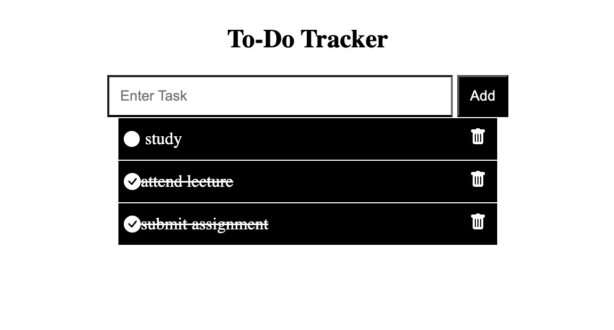

# 📝 To-Do Tracker

A full-stack To-Do application built using **React**, **Node.js**, **Express**, and **MongoDB**. This app allows users to create, read, update, and delete tasks.



## 🚀 Features
- **Add** a new task
- **View** all tasks
- **Mark tasks** as completed
- **Delete** tasks

## 🔧 Technologies Used
- **Frontend**: React, Axios
- **Backend**: Node.js, Express
- **Database**: MongoDB, Mongoose

## 📦 Installation

### Prerequisites
Make sure you have the following installed:
- **Node.js** (version 12 or higher)
- **MongoDB** (Running locally or a cloud instance)

### Backend Setup
1. Clone the repository:
    ```sh
    git clone https://github.com/your-username/todo-app.git
    ```
2. Navigate to the `server` directory:
    ```sh
    cd todo-app/server
    ```
3. Install dependencies:
    ```sh
    npm install
    ```
4. Start MongoDB locally (if not already running):
    ```sh
    brew services start mongodb-community@7.0
    ```
5. Start the backend server:
    ```sh
    node server.js  # Or use nodemon for auto-restarts
    ```

### Frontend Setup
1. Navigate to the `todo_tracker` directory 
    ```sh
    cd todo-app/todo_tracker
    ```
2. Install dependencies:
    ```sh
    npm install
    ```
3. Start the React development server:
    ```sh
    npm start
    ```
4. Your app should now be running at `http://localhost:3000` (Frontend) and `http://localhost:3001` (Backend).

## 🖥 Usage

### Frontend
The **React frontend** allows users to:
- Add new tasks
- View a list of all tasks
- Mark tasks as completed
- Delete tasks

### Backend
The **Node.js backend** exposes the following API endpoints:
- `POST /add`: Create a new task
- `GET /get`: Get all tasks
- `PUT /update/:id`: Mark a task as completed
- `DELETE /delete/:id`: Delete a task
